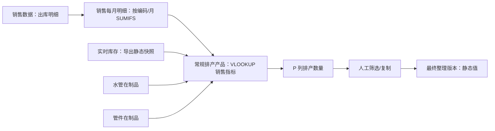

# 阶段 0：Excel 样表与现行业务分析

> 项目：福兰特轻量生产计划执行系统
> 分析日期：2026-07-17
> 结论范围：只还原现状、识别风险并提出系统化方案，不进入阶段 1 开发。

## 1. 输入文件与分析方法

本次读取了两份实际工作簿的工作表、单元格类型、公式、公式缓存、合并单元格、筛选范围、隐藏行、外部链接和有效数据范围。

1. `呆滞品统计截止到 2026-6-15.xlsx`
2. `2026年管件计划7.13-7.19(2).xlsx`

行数同时区分 Excel 声明的 `max_row` 和真实非空数据范围。前一工作簿的“常规排产产品”和“最终整理版本”分别声明到 1,039,600 行和 1,048,087 行，但真实非空内容只到 2,211 行和 506 行，属于历史格式残留造成的范围膨胀，不能直接按声明范围导入。

## 2. 工作簿一：补库及呆滞品统计

### 2.1 工作表总览

| 工作表 | Excel 声明范围 | 真实非空行 | 主要表头/字段 | 公式数 | 合并单元格 | 主要问题 |
|---|---:|---:|---|---:|---:|---|
| 销售数据 | A1:Z268030 | 268,030 | 审核日期、仓库、月份、出库日期、单号、类别、部门、客户、存货编码、名称、规格、单位、数量、价格、金额、批号 | 0 | 0 | 123,931 个隐藏行；筛选范围到 AF，超过实际 Z 列；2,151 个负数量，需区分退货/冲销；同编码名称或规格冲突 |
| 销售每月明细 | A1:AJ16932 | 16,932 | 编码、名称、规格、分类、单位、统计指标、2024-03 至 2026-05 月度数量 | 122,560 | 0 | 统计窗口硬编码且过期；公式缓存失效；筛选只到 AG，遗漏 AH:AJ；标题与公式含义不一致 |
| 实时库存 | A1:K14069 | 14,069 | 编码、代码、名称、规格、分类、单位、现存、预计入库、预计出库、可用量 | 0 | 0 | 可用量是导出静态值而非可审计公式；系统仍应自行复算并比对 |
| 管件在制品 | A1:O1360 | 1,227（最后非空行为 1360） | 批次、产品编码、名称、型号、上月入库/盘点、订单、未完成、成品/半成品入库；L:O 为编码汇总 | 2,167 | 0 | 62 个负“未完成”值、3 个 `#VALUE!`、动态数组依赖、编码重复且存在名称规格冲突 |
| 水管在制品 | A1:D566 | 388（253 条可识别产品行） | 产品编码、名称、型号、未入库数量 | 0 | 0 | 17 个负数；26 个编码被 Excel 读成数值；4 行缺编码；存在重复编码 |
| 常规排产产品 | A1:P1039600 | 2,211 | 编码、名称、规格、分类、单位、销售指标、库存展开列、水管/管件在制、排产数量 | 13,260 | 0 | 百万行虚假范围；H:I 表头与实际溢出值错位；负在制直接参与计算；文本 `"0"` 与数值 0 混用 |
| 最终整理版本 | A1:N1048087 | 506 | 编码、名称、规格、分类、单位、目标值、库存、在制、排产数量 | 0 | 0 | 百万行虚假范围；全部为静态值，无法追溯公式和计算批次；12 个负在制值 |

补充统计：

- “销售数据”有 11,756 个不同产品编码，其中 223 个编码对应多个名称/规格组合。部分是名称前缀变化（如“国 I”与“I”），不能自动视为不同产品，也不能仅按名称合并。
- “销售每月明细”出现 5 个重复编码；“管件在制品”出现 120 个重复编码（部分是同产品多批次，业务上合理），其中 14 个编码存在名称/规格冲突。
- 各来源按编码对齐后，有 399 个编码在不同工作表中出现名称或规格差异。产品编码应作为主关联键，名称和规格只用于提示与人工校验。
- “管件在制品”负数：未完成列 62 个，汇总未完成列 47 个；“水管在制品”负未入库 17 个；“最终整理版本”水管在制 9 个、管件在制 3 个。

### 2.2 关键表头与公式

#### 销售数据

第 1 行为单行表头，关键映射如下：

| Excel 列 | 含义 | 建议系统字段 |
|---|---|---|
| C | 审核日期 | `approved_date` |
| G | 月份（中文文本） | `shipment_month`，导入时规范为月份日期 |
| H | 出库日期 | `shipment_date` |
| I | 出库单号 | `document_no` |
| J/K | 出库类别编码/名称 | `shipment_type_code/name` |
| S | 存货编码 | `product_code_raw`，必须按文本读取 |
| T/U/V | 名称/规格/单位 | 产品冗余快照 |
| W | 数量（原表标题为“13”） | `quantity`；这是明显的表头异常，需映射确认 |
| Z | 批号 | `batch_no` |

#### 销售每月明细

第 2 行是表头，第 1 行是小计公式。主要公式为：

```text
F行 = SUBTOTAL(9, Y行:AJ行)
G行 = MAX(U行:Z行)
H行 = MINIFS(J行:AE行, J行:AE行, "<>0")
I行 = AVERAGE(M行:X行)
AG:AJ = 按产品编码和月份从“销售数据”SUMIFS 汇总
```

存在以下确定性差异：

1. F 列没有标题，但实际是 Y:AJ 的 12 个月合计，不是“月最大销售”。
2. G 列标题为“月最大销售”，但范围 U:Z 对应 2025-02 至 2025-07，并非截至 2026-05 的最近六个月。
3. H 列标题为“月最小销售”，范围 J:AE 是较长历史窗口，并排除 0。
4. I 列标题为“月平均”，范围 M:X 是 2024-06 至 2025-05 的 12 个月，并非最近六个月。
5. 第 1 行小计从第 1065 行开始，遗漏前部数据；自动筛选只到 AG，最新的 AH:AJ 三个月不在筛选范围内。
6. 公式缓存明显过期。例如公式单元格 F 的缓存仍为 0，但其引用月份已有非零数据。服务端不能信任 Excel 缓存值。

#### 常规排产产品

第 1 行表头和实际公式展开存在错位。H:M 由以下动态数组一次展开：

```text
XLOOKUP(产品编码, 实时库存!A:A, 实时库存!F:K)
```

因此 H:M 实际依次是“存货分类名称、主计量单位、现存数量、预计入库、预计出库、可用数量”，而原表 H:I 标为“现存数量、预计入库数量合计”，导致肉眼读取和程序按表头读取都会错列。

排产公式为：

```text
F = VLOOKUP(产品编码, 销售每月明细!A:I, 6, 0)
G = VLOOKUP(产品编码, 销售每月明细!A:I, 8, 0)
N = IFERROR(VLOOKUP(产品编码, 水管在制品!A:D, 4, 0), "0")
O = IFERROR(VLOOKUP(产品编码, 管件在制品!L:O, 4, 0), "0")
P = IF(M < F, F - M - N - O, "")
```

其中 F 实际取“销售每月明细”的第 6 列，即 12 个月合计，却被“常规排产产品”标成“月最大销售”；G 实际取第 8 列，即非零月最小值，却被标成“6 月平均”。这是当前算法最重要的语义错位。

此外，P 的条件只判断 `可用数量 < 目标值`，没有在扣除在制后再次截断为 0，因此可能产生负排产数；负在制也未按业务要求 `MAX(value, 0)` 处理。

#### 最终整理版本

该表只有静态值，没有任何公式。抽样值与当前上游公式重算结果不一致，说明它可能由某个较早时间点的筛选、复制、粘贴形成。它可以作为人工结果对照，不能作为可审计的计算来源。

### 2.3 现行补库逻辑还原

从工作簿能确定的实际流程如下：



按原表公式，实际近似为：

```text
原表目标值 = 销售每月明细 F 列（当前公式为最近固定 12 列合计）
原表可用量 = 实时库存导出的 K 列静态值
原表排产量 = 原表目标值 - 可用量 - 水管在制 - 管件在制
```

它与需求规定的系统公式存在三项差异：

1. 目标库存算法没有可靠实现“最近六个月最大/平均、最近三个月平均、加权平均”等可选算法。
2. 没有扣除“已排未开工数量”。
3. 没有对两类在制分别执行 `MAX(value, 0)`，也没有对最终建议执行 `MAX(result, 0)`。

系统应以需求规定公式为准：

```text
available_qty = on_hand_qty + expected_inbound_qty - expected_outbound_qty
effective_wip = MAX(pipe_wip_qty, 0) + MAX(fitting_wip_qty, 0)
suggested_qty = target_stock_qty - available_qty - effective_wip - scheduled_not_started_qty
```

仅当 `suggested_qty > 0` 时生成建议，并且保存目标算法、全部输入值、公式版本和计算日期。

## 3. 工作簿二：2026-07-13 至 2026-07-19 周计划

### 3.1 工作表总览

| 工作表 | 范围 | 非空行 | 计划任务行 | 表头结构 | 公式数 | 外部引用公式 | 合并单元格 | 主要问题 |
|---|---:|---:|---:|---|---:|---:|---:|---|
| 制管 | A1:BC70 | 69 | 29 | 1-2 行标题；3-5 行三层表头；每任务“计划/实际”两行；N:T 为 7 天 | 366 | 212 | 287 | 依赖外部日报；同批次在同工序重复出现；3 个任务日计划为 0；产品无系统编码 |
| 包装 | A1:T112 | 110 | 51 | 1-2 行标题；3-4 行表头；计划/实际两行；L:R 为 7 天 | 191 | 0 | 455 | 批次 `20260701` 被 11 个不同产品共用；无标准产能；产品编码缺失；部分计划从实际公式推导 |
| 成型 | A1:X46 | 45 | 17 | 1-2 行标题；3-5 行表头；计划/实际两行；M:S 为 7 天 | 215 | 136 | 171 | 设备通过纵向合并继承；2 个任务日计划为 0；依赖外部压机日报 |
| 下料 | A1:V51 | 50 | 23 | 1-2 行标题；3-4 行表头；计划/实际两行；J:P 为 7 天 | 82 | 0 | 167 | 周期是 7/10-7/16，与其余工作表的 7/13-7/19 不一致；6 个后段任务无标准产能且日计划为 0；无设备列 |

整本工作簿有一个外部链接：

```text
file:///D:/新建文件夹 (2)/每日报表/guanj.XLS
```

外部文件未随样表提供。`制管`和`成型`的库存/实际完成量大量由 `VLOOKUP`、`XLOOKUP`、`SUMIFS` 从该文件读取；一旦路径变化、外部文件未更新或公式缓存过期，计划表中的实际值就不可靠。

### 3.2 典型布局与公式

四张表都不是一行一个任务，而是：

```text
产品及批次字段（通常纵向合并两行）
  ├─ 计划行：每日计划、周计划、计划工时
  └─ 实际行：每日实际、周实际
```

典型公式：

```text
周计划/周实际 = SUM(七个日期列)
计划工时 = 周计划 / 标准产能 * 8
制管实际 = SUMIFS(外部日报数量, 日期, 批次号, 设备)
成型库存 = XLOOKUP(批次号, 外部压机表批次, 外部压机表库存)
成型实际 = SUMIFS(外部压机日报数量, 日期, 批次号, 工序)
下料进度 = (本周实际 + 上周完成数) / 月计划数
```

日期既有 Excel 日期序号（如 46216），也有整数日号（如 13），导入必须结合工作表标题中的年月和单元格日期格式解析。

### 3.3 周计划如何由补库结果形成

两份样表之间不存在可机读的直接链路，原因如下：

1. 补库结果以产品编码为主键；四张周计划表均没有产品编码。
2. 周计划使用“产品名称 + 规格 + 生产批次号”，其中名称和规格与主数据存在别名、简写和材质后缀差异。
3. 周计划没有补库建议编号或生产需求编号，无法证明某行来自哪条补库建议。
4. “最终整理版本”没有公式和确认记录，也没有转需求记录。
5. 周计划的计划数量大多为人工填入；公式主要用于汇总或从外部日报回填实际量。

因此当前流程只能还原为：计划员查看/复制补库结果，按经验决定工序、设备、批次与每日数量，再分别填入工作表。不能从现有文件证明“某个补库数量完整且唯一地进入了哪些周计划任务”。

## 4. 漏排、少排和重复排产风险定位

| 风险 | 发生位置 | 证据 | 系统控制 |
|---|---|---|---|
| 漏排 | “最终整理版本”到周计划的人工复制 | 2,210 个常规产品最终只保留 505 行，且无需求编号/转化记录 | 确认后生成不可物理删除的 `ProductionDemand`；需求池持续显示剩余待排 |
| 少排 | 一个需求拆到多工序/多周时 | Excel 只记录任务数量，不记录其占用的需求数量 | 用 `DemandAllocation` 逐笔占用；显示确认量、有效排产量和缺口 |
| 重复排产 | 多次复制到不同周计划 | 没有跨周唯一需求标识；制管同表已有批次重复 | 分配事务加行锁/乐观锁；同需求有效分配量超限即阻止或预警 |
| 重复补库 | 下一轮补库 | 原表没有扣除已排未开工数量 | 计算快照中明确保存并扣除 `scheduled_not_started_qty` |
| 负数放大建议 | 两类在制品和排产公式 | 水管负数 17 个、管件未完成负数 62 个；原公式直接相减 | 原始值保留并生成数据异常；计算值使用 `MAX(value, 0)` |
| 算法漂移 | 月度明细和最终整理版本 | 硬编码月份范围过期；公式缓存与静态最终值不一致 | 服务端按计算基准日动态取月；保存算法版本和输入快照 |
| 工序漏排 | 周计划表之间 | 计划表没有工艺模板，也没有必需工序校验 | 产品绑定工艺模板；生成任务后检查所有必需工序 |
| 前后工序倒挂 | 下料/成型等独立工作表 | 同批次跨工序，但无前序可用量约束 | `ProcessTemplateStep.sequence_no` + 前序完成/在制校验 |
| 计划丢失 | 插单或切换周文件 | 每周一个 Excel，变更无版本链 | 计划版本、变更日志、插单记录；原任务只改状态不删除 |
| 设备冲突 | 设备靠合并单元格表示 | 导入时空白单元格实为继承上方设备；Excel 无时间区间约束 | 导入先填充合并值；任务存开始/结束时间并检查冲突 |
| 实际量失真 | 外部链接 | 348 个公式依赖本地 `guanj.XLS` | 生产报工进入系统；Excel 外链只作过渡导入并标记来源 |
| 周期错位 | 下料表 | 下料为 7/10-7/16，其余为 7/13-7/19 | 工作表级周期校验；跨工序日期不一致生成 `DataIssue` |

## 5. 阶段 0 结论

1. 现有 Excel 可以提供原始销售、库存、在制和周任务输入，但不能继续承担需求生命周期与审计职责。
2. “最终整理版本”只能作为历史对照，不能作为系统计算逻辑；服务端应从原始快照重新计算。
3. 第一优先级不是排产 UI，而是建立“导入批次 → 补库计算快照 → 人工确认 → 生产需求 → 任务分配”的完整证据链。
4. 周计划导入时，缺少产品编码的行不得仅按名称自动入正式任务；应进入待匹配区，由用户确认产品编码后再落库。
5. 阶段 1 应先交付基础工程、主数据骨架、导入批次与样表解析验证，不应直接实现完整排产中心。
