# 阶段 0：系统设计草案

本文基于实际样表提出第一版数据库、API、页面字段和 Excel 导入映射。设计重点是可追溯、不可丢需求和可检查，而不是复刻 Excel 单元格。

## 1. 核心业务链


硬约束：

- 补库建议保存原始输入、算法、系统建议、人工确认、修改人和修改原因。
- 生产需求不物理删除；取消必须记录人、时间和原因。
- 任务必须通过需求分配表占用需求，不能只复制数量。
- `remaining_to_schedule = confirmed_qty - active_allocated_qty`。
- `remaining_to_complete = confirmed_qty - qualified_completed_qty`。
- 只要剩余待排大于 0，需求就持续留在待排池。
- 所有表均含 `created_at`、`updated_at`；本文字段表中不再逐表重复。
- 数量统一使用 `NUMERIC(18, 6)`，禁止浮点数；时间统一保存带时区时间，业务日期单独用 `DATE`。

## 2. ER 设计

### 2.1 关系总图

```mermaid
erDiagram
    PRODUCT_FAMILY ||--o{ PRODUCT : contains
    PRODUCT ||--o| REPLENISHMENT_POLICY : uses
    PRODUCT ||--o{ MONTHLY_SHIPMENT : has
    PRODUCT ||--o{ INVENTORY_SNAPSHOT : has
    PRODUCT ||--o{ WIP_SNAPSHOT : has

    IMPORT_BATCH ||--o{ IMPORT_SHEET : contains
    IMPORT_BATCH ||--o{ IMPORT_ROW_ERROR : reports
    IMPORT_BATCH ||--o{ MONTHLY_SHIPMENT : imports
    IMPORT_BATCH ||--o{ INVENTORY_SNAPSHOT : imports
    IMPORT_BATCH ||--o{ WIP_SNAPSHOT : imports

    REPLENISHMENT_RUN ||--o{ REPLENISHMENT_SUGGESTION : produces
    PRODUCT ||--o{ REPLENISHMENT_SUGGESTION : receives
    REPLENISHMENT_SUGGESTION ||--o| PRODUCTION_DEMAND : converts_to

    PROCESS_TEMPLATE ||--o{ PROCESS_TEMPLATE_STEP : contains
    PROCESS_STEP ||--o{ PROCESS_TEMPLATE_STEP : references
    PRODUCT ||--o{ PRODUCT_PROCESS_TEMPLATE : binds
    PROCESS_TEMPLATE ||--o{ PRODUCT_PROCESS_TEMPLATE : binds

    PRODUCTION_PLAN ||--o{ PRODUCTION_PLAN_VERSION : versions
    PRODUCTION_PLAN_VERSION ||--o{ PRODUCTION_TASK : contains
    PRODUCTION_DEMAND ||--o{ DEMAND_ALLOCATION : allocated_by
    PRODUCTION_TASK ||--o{ DEMAND_ALLOCATION : consumes
    PROCESS_STEP ||--o{ PRODUCTION_TASK : executes
    EQUIPMENT ||--o{ PRODUCTION_TASK : assigned_to
    MOLD ||--o{ PRODUCTION_TASK : uses
    PRODUCTION_TASK ||--o{ TASK_DAILY_SCHEDULE : split_by_day
    PRODUCTION_TASK ||--o{ WORK_REPORT : reports

    PRODUCT ||--o{ PRODUCT_CAPACITY : has
    EQUIPMENT ||--o{ PRODUCT_CAPACITY : supports
    PROCESS_STEP ||--o{ PRODUCT_CAPACITY : applies_to
    PRODUCT ||--o{ PRODUCT_MOLD : needs
    MOLD ||--o{ PRODUCT_MOLD : supports

    PRODUCTION_PLAN ||--o{ RUSH_ORDER_RECORD : changes
    PRODUCTION_PLAN ||--o{ PLAN_CHANGE_LOG : logs
    PRODUCTION_DEMAND ||--o{ DATA_ISSUE : may_raise
    PRODUCTION_TASK ||--o{ DATA_ISSUE : may_raise

    USER ||--o{ USER_ROLE : owns
    ROLE ||--o{ USER_ROLE : grants
    USER ||--o{ AUDIT_LOG : performs
```



### 2.2 主数据与工艺

| 表 | 关键字段 | 约束/说明 |
|---|---|---|
| `product_family` | `id`, `code`, `name`, `parent_id`, `is_active` | `code` 唯一；支持树形产品族 |
| `product` | `id`, `code`, `name`, `specification`, `family_id`, `unit`, `is_regular`, `min_batch_qty`, `replenishment_mode`, `is_active` | `code` 唯一且按字符串保存；20,000 SKU 使用服务端模糊搜索和分页 |
| `product_alias` | `id`, `product_id`, `source_system`, `alias_name`, `alias_specification` | 保存不同 Excel/ERP 中的名称规格别名，不改变主档 |
| `replenishment_policy` | `id`, `product_id`, `algorithm`, `fixed_target_qty`, `weight_config_json`, `effective_from`, `effective_to` | 算法：六个月最大、六个月平均、三个月平均、六个月加权、固定目标、订单生产 |
| `process_step` | `id`, `code`, `name`, `default_sequence`, `is_active` | 初始含制管、下料、成型、包装，可扩展 |
| `process_template` | `id`, `code`, `name`, `version`, `is_active` | 模板有版本，不直接覆盖历史版本 |
| `process_template_step` | `id`, `template_id`, `process_step_id`, `sequence_no`, `is_required`, `overlap_allowed`, `yield_rate` | `(template_id, sequence_no)` 唯一 |
| `product_process_template` | `id`, `product_id`, `template_id`, `effective_from`, `effective_to` | 保存产品历史工艺绑定 |
| `equipment` | `id`, `code`, `name`, `process_step_id`, `calendar_code`, `is_active` | 设备编码唯一 |
| `mold` | `id`, `code`, `name`, `status`, `is_active` | 状态含可用、维修、停用 |
| `product_capacity` | `id`, `product_id`, `process_step_id`, `equipment_id`, `standard_qty`, `standard_hours`, `effective_from`, `effective_to` | 标准产能带生效期 |
| `product_mold` | `id`, `product_id`, `process_step_id`, `mold_id`, `is_primary` | 产品/工序与模具关系 |

### 2.3 导入与原始快照

| 表 | 关键字段 | 约束/说明 |
|---|---|---|
| `import_batch` | `id`, `batch_no`, `import_type`, `file_name`, `file_sha256`, `file_size`, `status`, `source_date`, `started_by`, `started_at`, `completed_at`, `rollback_at`, `rollback_by` | `file_sha256 + import_type + source_date` 防重复；状态含校验中、可导入、已完成、失败、已撤销 |
| `import_sheet` | `id`, `import_batch_id`, `sheet_name`, `header_row_start`, `header_row_end`, `declared_rows`, `effective_rows`, `mapping_json` | 保存实际选表和字段映射 |
| `import_row_error` | `id`, `import_batch_id`, `sheet_name`, `row_no`, `field_name`, `raw_value`, `error_code`, `message`, `severity` | 可导出为错误 Excel/CSV |
| `monthly_shipment` | `id`, `import_batch_id`, `product_id`, `shipment_month`, `quantity`, `source_document_count` | `(import_batch_id, product_id, shipment_month)` 唯一；原始出库明细可先进入暂存表后聚合 |
| `shipment_staging` | `id`, `import_batch_id`, `row_no`, `document_no`, `shipment_date`, `shipment_month`, `product_code_raw`, `name_raw`, `spec_raw`, `unit_raw`, `quantity_raw`, `shipment_type_code`, `batch_no`, `validation_status` | 保存原始行和退货/冲销符号；成功发布后可按保留策略归档 |
| `inventory_snapshot` | `id`, `import_batch_id`, `product_id`, `snapshot_date`, `on_hand_qty`, `expected_inbound_qty`, `expected_outbound_qty`, `source_available_qty`, `calculated_available_qty` | 保留 ERP 原值，并由系统复算可用量 |
| `wip_snapshot` | `id`, `import_batch_id`, `product_id`, `snapshot_date`, `wip_type`, `raw_qty`, `effective_qty`, `production_batch_no` | `wip_type` 为 PIPE/FITTING；`effective_qty = max(raw_qty, 0)`；负值同时生成异常 |

### 2.4 补库与生产需求

| 表 | 关键字段 | 约束/说明 |
|---|---|---|
| `replenishment_run` | `id`, `run_no`, `calculation_date`, `formula_version`, `shipment_batch_id`, `inventory_batch_id`, `pipe_wip_batch_id`, `fitting_wip_batch_id`, `status`, `created_by` | 一次补库计算的根对象；输入批次固定后不可悄悄替换 |
| `replenishment_suggestion` | `id`, `run_id`, `product_id`, `algorithm`, `monthly_qty_json`, `six_month_max`, `six_month_avg`, `three_month_avg`, `weighted_avg`, `fixed_target_qty`, `target_stock_qty`, `on_hand_qty`, `expected_inbound_qty`, `expected_outbound_qty`, `available_qty`, `pipe_wip_raw_qty`, `pipe_wip_effective_qty`, `fitting_wip_raw_qty`, `fitting_wip_effective_qty`, `scheduled_not_started_qty`, `system_suggested_qty`, `confirmed_qty`, `review_status`, `reviewed_by`, `reviewed_at`, `change_reason` | 保存完整计算快照；`(run_id, product_id)` 唯一；确认量变更必须有原因 |
| `production_demand` | `id`, `demand_no`, `product_id`, `source_type`, `source_id`, `confirmed_qty`, `active_allocated_qty`, `qualified_completed_qty`, `remaining_to_schedule_qty`, `remaining_to_complete_qty`, `status`, `created_date`, `cancelled_by`, `cancelled_at`, `cancel_reason`, `closed_by`, `closed_at` | `demand_no` 唯一；不物理删除；数量字段由事务内重算或数据库约束保护 |
| `demand_allocation` | `id`, `demand_id`, `task_id`, `allocated_qty`, `status`, `released_qty`, `allocation_version` | 一条任务可合并多个需求，一个需求可拆多个任务；有效占用量不能使需求超分配 |

需求状态：`PENDING_REVIEW`、`PENDING_SCHEDULE`、`PARTIALLY_SCHEDULED`、`FULLY_SCHEDULED`、`IN_PROGRESS`、`COMPLETED`、`CANCELLED`、`CLOSED`。

### 2.5 计划、任务与报工

| 表 | 关键字段 | 约束/说明 |
|---|---|---|
| `production_plan` | `id`, `plan_no`, `week_start`, `week_end`, `status`, `current_version_no`, `published_at`, `published_by` | 周期唯一策略需结合工序/工厂；状态草稿、已发布、执行中、已完成、已取消 |
| `production_plan_version` | `id`, `plan_id`, `version_no`, `change_reason`, `snapshot_json`, `created_by` | `(plan_id, version_no)` 唯一；发布/插单/顺延均留版本 |
| `production_task` | `id`, `task_no`, `plan_version_id`, `product_id`, `process_step_id`, `production_batch_no`, `equipment_id`, `mold_id`, `planned_qty`, `planned_start_at`, `planned_end_at`, `standard_capacity_qty`, `standard_capacity_hours`, `priority`, `status`, `source_import_batch_id` | 不依赖名称关联；任务取消/顺延保留历史 |
| `task_daily_schedule` | `id`, `task_id`, `work_date`, `planned_qty`, `planned_hours`, `sequence_no` | `(task_id, work_date, sequence_no)` 唯一；支持同任务一天多时间段 |
| `work_report` | `id`, `task_id`, `report_date`, `planned_qty_snapshot`, `qualified_qty`, `unqualified_qty`, `scrap_qty`, `actual_start_at`, `actual_end_at`, `incomplete_reason`, `exception_note`, `reported_by`, `reversed_at`, `reversed_by`, `reverse_reason` | 报工可冲销，不物理删除；合格量驱动需求完成量 |
| `rush_order_record` | `id`, `plan_id`, `task_id`, `inserted_task_id`, `occupied_capacity_qty`, `reason`, `requested_by`, `approved_by` | 插单必须记录对原任务的影响 |
| `plan_change_log` | `id`, `plan_id`, `plan_version_id`, `task_id`, `change_type`, `before_json`, `after_json`, `reason`, `changed_by` | 关键计划变更审计 |

### 2.6 异常、用户与审计

| 表 | 关键字段 | 约束/说明 |
|---|---|---|
| `data_issue` | `id`, `issue_no`, `issue_type`, `severity`, `product_id`, `demand_id`, `task_id`, `plan_id`, `gap_qty`, `duration_days`, `reason`, `suggested_action`, `first_detected_at`, `last_detected_at`, `status`, `resolved_by`, `resolved_at`, `resolution_note`, `dedupe_key` | `dedupe_key` 防止同一问题每次扫描重复建单；解决后再次发生可重新打开 |
| `user` | `id`, `username`, `password_hash`, `display_name`, `process_step_id`, `is_active`, `last_login_at` | 班组长通过 `process_step_id` 限制工序 |
| `role` | `id`, `code`, `name`, `permissions_json` | 初始 ADMIN、PLANNER、FOREMAN、VIEWER |
| `user_role` | `user_id`, `role_id` | 复合主键 |
| `audit_log` | `id`, `request_id`, `user_id`, `action`, `entity_type`, `entity_id`, `before_json`, `after_json`, `reason`, `ip_address`, `occurred_at` | 追加写；业务更新与审计尽量同事务 |

## 3. 主要 REST API 清单

统一前缀 `/api/v1`。列表接口统一支持 `page`、`page_size`、`sort` 和字段化筛选；错误返回稳定的 `code`、`message`、`details`、`request_id`。

### 3.1 认证与用户

| 方法 | 路径 | 用途 |
|---|---|---|
| POST | `/auth/login` | 登录并返回访问令牌 |
| POST | `/auth/refresh` | 刷新令牌 |
| GET | `/auth/me` | 当前用户及权限 |
| GET/POST | `/users` | 用户分页/新建 |
| GET/PATCH | `/users/{id}` | 用户详情/修改 |
| GET/POST | `/roles` | 角色列表/新建 |
| PUT | `/users/{id}/roles` | 分配角色 |

### 3.2 主数据

| 方法 | 路径 | 用途 |
|---|---|---|
| GET/POST | `/products` | 产品分页/新建；`keyword` 搜索编码、名称、规格 |
| GET/PATCH | `/products/{id}` | 产品详情/修改 |
| GET/POST | `/product-families` | 产品族 |
| GET/POST | `/process-steps` | 工序定义 |
| GET/POST | `/process-templates` | 工艺模板 |
| PUT | `/process-templates/{id}/steps` | 保存模板工序 |
| GET/POST | `/equipment` | 设备 |
| GET/POST | `/molds` | 模具 |
| GET/POST | `/capacities` | 标准产能 |
| PUT | `/products/{id}/replenishment-policy` | 产品补库策略 |

### 3.3 导入中心

| 方法 | 路径 | 用途 |
|---|---|---|
| POST | `/imports/upload` | 上传文件并计算哈希，返回工作表元数据 |
| GET | `/imports/{id}/sheets` | 工作表、真实范围、表头候选和合并信息 |
| POST | `/imports/{id}/preview` | 按选表/表头/字段映射生成预览 |
| POST | `/imports/{id}/validate` | 全量校验，不写正式业务表 |
| GET | `/imports/{id}/errors` | 分页查看错误 |
| GET | `/imports/{id}/errors/export` | 下载错误行 |
| POST | `/imports/{id}/commit` | 提交导入；需幂等键 |
| POST | `/imports/{id}/rollback` | 撤销尚未被后续业务引用的导入 |
| GET | `/imports` | 导入批次列表 |

### 3.4 补库与需求

| 方法 | 路径 | 用途 |
|---|---|---|
| POST | `/replenishment-runs` | 选择输入批次和计算日期，创建计算 |
| GET | `/replenishment-runs/{id}` | 计算批次详情 |
| GET | `/replenishment-suggestions` | 建议中心分页/筛选 |
| PATCH | `/replenishment-suggestions/{id}` | 修改算法或确认量，强制提交原因 |
| POST | `/replenishment-suggestions/batch-review` | 批量审核/退回 |
| POST | `/replenishment-suggestions/batch-convert` | 幂等地转生产需求 |
| GET | `/production-demands` | 需求池 |
| GET | `/production-demands/{id}` | 需求、分配、完成和变更链 |
| POST | `/production-demands/{id}/cancel` | 取消并记录原因 |
| POST | `/production-demands/{id}/close` | 关闭并记录原因 |

### 3.5 排产、任务与报工

| 方法 | 路径 | 用途 |
|---|---|---|
| GET/POST | `/production-plans` | 周计划列表/新建 |
| GET | `/production-plans/{id}` | 计划与当前版本 |
| POST | `/production-plans/{id}/tasks` | 从一个或多个需求创建任务及分配 |
| PATCH | `/production-tasks/{id}` | 调整设备、日期、数量；需原因 |
| POST | `/production-tasks/{id}/split` | 拆分任务并同步需求占用 |
| POST | `/production-plans/{id}/rush-orders` | 插单并生成影响记录 |
| POST | `/production-plans/{id}/publish` | 校验后发布并固化版本 |
| POST | `/production-plans/{id}/versions` | 保存新版本 |
| GET | `/production-plans/{id}/export` | 导出接近原四张工作表的 Excel |
| GET | `/production-tasks` | 按工序、设备、日期、状态查询 |
| POST | `/production-tasks/{id}/work-reports` | 报工 |
| POST | `/work-reports/{id}/reverse` | 冲销报工 |

### 3.6 看板、异常与审计

| 方法 | 路径 | 用途 |
|---|---|---|
| GET | `/dashboard/summary` | 首页指标 |
| GET | `/dashboard/weekly-completion` | 周完成率趋势 |
| GET | `/data-issues` | 异常分页、分类和筛选 |
| POST | `/data-issues/scan` | 触发规则扫描（后台任务） |
| POST | `/data-issues/{id}/resolve` | 处理异常 |
| GET | `/audit-logs` | 审计查询 |

## 4. 前端页面与字段清单

### 4.1 首页看板

- 筛选：计算批次、周计划、产品族、工序。
- 指标：本轮建议数量/条数、待审核、完全未排、部分排产、连续两周未排、库存风险、数据异常、本周计划完成率。
- 图表：需求状态分布、工序周负荷、最近四周完成率、异常类型 Top N。
- 明细跳转必须携带当前筛选条件。

### 4.2 数据导入中心

- 批次列表：批次号、类型、文件名、来源日期、哈希、状态、总行、成功行、警告行、错误行、导入人、时间、是否可撤销。
- 向导：上传 → 工作表选择 → 表头行选择 → 字段映射 → 预览 → 全量校验 → 提交。
- 预览字段：Excel 行号、原始值、规范化值、匹配产品、校验状态、问题说明。
- 错误下载和撤销按钮必须展示影响范围。

### 4.3 补库建议中心

- 固定列：产品编码、名称、规格、产品族。
- 销售列：六个月逐月值、六个月最大、六个月平均、三个月平均、加权平均。
- 库存列：现存、预计入库、预计出库、可用量。
- 在制/计划列：水管原始/有效在制、管件原始/有效在制、已排未开工。
- 结果列：算法、目标库存、系统建议、人工确认、审核状态、异常提示、修改原因。
- 操作：批量改算法、批量确认、审核/退回、转生产需求、查看计算证据。

### 4.4 生产需求池

- 字段：需求编号、产品、来源、确认数量、有效排产量、合格完成量、剩余待排、剩余待完成、创建日期、未排天数、跨周次数、状态、备注。
- 筛选：状态、来源、产品族、未排天数、是否有异常、创建日期。
- 详情：来源建议快照、任务分配、报工、状态变化、审计日志。

### 4.5 周排产中心

- 左侧待排池：需求编号、产品、工艺、剩余待排、优先级、连续未排天数。
- 右侧周计划：按工序/设备分组，日期为列，任务为行；支持拆分、合并、顺延和插单。
- 任务字段：任务号、需求来源、产品、批次、工序、设备、模具、计划量、日期分配、标准产能、计划工时、前序可用量、冲突提示。
- 发布前校验：超分配、设备/模具冲突、超产能、前序不足、必需工序缺失、零计划任务。

### 4.6 工序任务与生产报工

- 工序任务：任务号、计划周、产品、批次、设备、计划量、日计划、状态、前序状态、异常。
- 班组长只能查看授权工序。
- 报工：计划数量快照、合格、不合格、报废、实际开始/结束、未完成原因、异常说明。
- 未完成量显示为 `计划量 - 合格量 - 不合格量 - 报废量`，是否结转由用户明确操作。

### 4.7 异常预警

- 字段：等级、类型、产品、需求编号、任务号、原因、缺口数量、持续天数、建议动作、首次/最近发现时间、责任工序、状态、处理说明。
- 红色仅用于必须立即处理，橙色为风险，黄色为提示，绿色为完成。

### 4.8 基础资料、权限和审计

- 产品、产品族、补库策略、工艺模板、工序、设备、模具、产能、用户、角色。
- 产品选择器统一使用服务端搜索，禁止加载 20,000 SKU 到普通下拉框。
- 审计页支持按人、时间、对象类型、对象编号、动作查询前后值和原因。

## 5. Excel 导入映射方案

### 5.1 通用解析规则

1. 以 `openpyxl` 读取工作簿结构、公式、合并单元格和原始类型；以 `pandas` 处理规范化后的批量数据和统计。不得用 `pandas.read_excel(header=0)` 直接假定单行表头。
2. 先识别真实非空范围，忽略仅有格式的百万空行。
3. 合并单元格先建立“主单元格 → 覆盖区域”映射；业务字段纵向填充仅限明确合并范围，不对普通空白盲目 `ffill`。
4. 产品编码按文本读取：去除首尾空格；数值型编码按单元格显示格式尽可能还原；科学计数法或无法确认的前导零进入人工校验。
5. 数量使用 `Decimal`，空白与 0 区分；文本 `"0"` 可规范为数值 0，但保留原始值。
6. 日期支持 Excel 序列、日期对象、中文月份、字符串日期和“日号 + 工作表年月”组合。
7. 公式同时保存公式文本与缓存值；核心指标由服务端重算，缓存只用于差异提示。
8. 文件哈希、导入类型、来源日期用于重复导入防护；提交接口还需幂等键。

### 5.2 补库工作簿映射

| 工作表 | 处理策略 | 关键映射 |
|---|---|---|
| 销售数据 | 导入原始出库暂存，再按产品/月聚合 | S→产品编码，T→名称快照，U→规格快照，V→单位，W→数量，G/H→月份/日期，I→单号，J/K→出库类型，Z→批号 |
| 销售每月明细 | 只作为校验对照，不作为权威计算结果 | A→编码，J:AJ→历史月度值；服务端与销售明细聚合结果比对 |
| 实时库存 | 正式库存快照来源 | A→编码，H→现存，I→预计入库，J→预计出库，K→ERP 可用量；系统另算 `H+I-J` |
| 管件在制品 | 正式管件在制来源；优先读取 A:J 原始批次行并服务端聚合 | A→批次，B→编码，C/D→名称/规格，H→未完成；L:O 动态数组只作对照 |
| 水管在制品 | 正式水管在制来源 | A→编码，B/C→名称/规格，D→原始未入库；负值保留并将有效值置 0 |
| 常规排产产品 | 导入常规产品清单，不导入其 P 列为系统建议 | A→编码；产品主档标记 `is_regular=true`；其公式结果只作差异报告 |
| 最终整理版本 | 历史人工结果对照 | A→编码，F:N→历史快照；不得直接生成生产需求 |

### 5.3 周计划工作簿映射

| 工作表 | 表头/日期 | 任务字段 | 计划/实际拆分 |
|---|---|---|---|
| 制管 | 标题 1-2 行，表头 3-5 行；N:T 日期 | A/B 设备，C 名称，D 规格，E 批次，F 工序，J 产能，U:BC 备注扩展 | L=`计划/实际`，M 周合计，N:T 日数量 |
| 包装 | 标题 1-2 行，表头 3-4 行；L:R 日期 | A 设备，B 名称，C 规格，D 批次，E 工序，H 产能（样表基本为空），S 备注 | J=`计划/实际`，K 周合计，L:R 日数量 |
| 成型 | 标题 1-2 行，表头 3-5 行；M:S 日期 | A 设备，B 模具状态，C 名称，D 规格，E 批次，F 工序，I 产能，T:X 备注扩展 | K=`计划/实际`，L 周合计，M:S 日数量 |
| 下料 | 标题 1-2 行，表头 3-4 行；J:P 日期 | A 名称，B 规格，C 批次，D 月计划，F 上周完成，G 产能，Q 备注 | H=`计划/实际`，I 周合计，J:P 日数量 |

周计划正式导入前必须增加“产品匹配”步骤：

- 若批次号可通过 ERP/在制数据唯一找到产品编码，可自动建议并展示证据。
- 若不能唯一找到，只能进入待匹配；用户从服务端产品搜索中确认编码。
- 名称/规格近似匹配只能排序候选，不能自动提交。
- 同一批次跨工序出现是正常候选关系，应串为同一生产批次；同一批次同工序多行需提示用户确认是拆分还是重复。
- 工作表周范围不一致时阻止整本直接发布，可允许各表分别导入到不同计划周期。

## 6. 关键计算与并发约束

补库计算使用纯函数服务并单元测试，输入和输出均为 `Decimal`：

```text
target_stock_qty = selected_algorithm(monthly_shipments, policy)
available_qty = on_hand_qty + expected_inbound_qty - expected_outbound_qty
effective_wip_qty = max(pipe_wip_raw_qty, 0) + max(fitting_wip_raw_qty, 0)
raw_suggested_qty = target_stock_qty - available_qty - effective_wip_qty - scheduled_not_started_qty
system_suggested_qty = max(raw_suggested_qty, 0)
```

需求分配必须在数据库事务内锁定需求记录并重新汇总有效分配，禁止两个并发请求同时超额占用。状态不由前端直接写入，而由确认量、有效分配量、合格完成量和取消/关闭动作派生。

## 7. 异常规则首版落点

需求提出的 15 类检查分别由定时扫描和写入时校验实现：

- 写入时阻止：超分配、设备时间冲突、明显超产能、同需求同任务重复占用、缺必需工序。
- 写入时警告并允许授权覆盖：前序不足、模具冲突、插单导致顺延。
- 定时扫描：确认未排、少排、跨周未排、无报工、未完成未结转、负在制、数据缺失、计划逾期。
- 每条异常生成稳定 `dedupe_key`，页面必须展示原因、缺口、持续天数和建议动作，而非只显示颜色。
