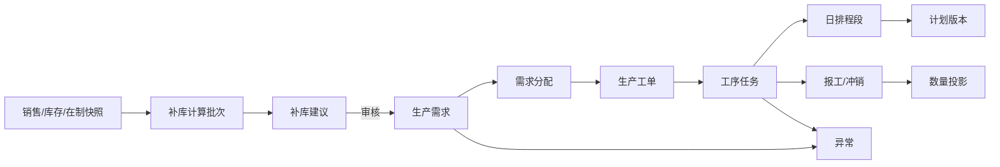

# 可借鉴数据模型

## 1. 建模原则

本模型不是四个开源项目表结构的拼接，而是针对福兰特业务重新设计。概念来源如下：

- 从 OpenMES 吸收“工艺模板版本—执行快照—步骤实例”。
- 从 ERPNext 吸收 Work Order、Routing、Workstation、Job Card 的职责分离。
- 从 frePPLe 吸收需求与供应分配、资源日历、冻结程度、可行性问题。
- 从 yuwang/MES 吸收轻量领域分层和小而清晰的 DTO/服务边界。

核心对象链建议统一为：



建议在进入编码前，将阶段 0 文档中的 `production_task` 明确拆为：

- `work_order`：产品/生产批次层的执行根对象，相当于轻量制造工单；
- `operation_task`：某工序、设备、时间段上的可排产和可报工对象。

这样不会让同一张表同时承担“整批产品工单”和“周甘特条”两种含义。

## 2. 产品与补库主数据

### 2.1 产品主档

| 表 | 关键字段 | 规则 |
|---|---|---|
| `product_family` | `code`, `name`, `parent_id`, `is_active` | 支持树形分类；编码唯一 |
| `product` | `code`, `name`, `specification`, `family_id`, `base_uom`, `make_policy`, `is_regular`, `min_batch_qty`, `qty_multiple`, `is_active` | 20,000 SKU；编码按文本；`make_policy` 为 MTS/MTO |
| `product_alias` | `product_id`, `source_system`, `alias_code`, `alias_name`, `alias_specification` | 用于 Excel/ERP 异名匹配，不覆盖主档 |
| `product_replenishment_policy` | `product_id`, `algorithm`, `fixed_target_qty`, `safety_stock_qty`, `coverage_days`, `effective_from`, `effective_to` | 有效期不可重叠；修改必须审计 |

产品主档不吸收 ERPNext 的采购、销售、会计、估价和仓库全量字段，也不吸收 frePPLe 的多级分销网络。单位换算若样表确认只使用单一计量单位，可延后实现。

### 2.2 历史需求与库存投影输入

| 表 | 关键字段 | 用途 |
|---|---|---|
| `shipment_history` | `product_id`, `business_date`, `month`, `qty`, `source_batch_id`, `source_row_no` | 保存正向发货和退货/冲销符号；月度汇总可重算 |
| `inventory_snapshot` | `product_id`, `snapshot_at`, `on_hand_qty`, `expected_in_qty`, `expected_out_qty`, `source_batch_id` | 某一时点库存事实 |
| `wip_snapshot` | `product_id`, `snapshot_at`, `wip_stage`, `raw_qty`, `effective_qty`, `batch_no`, `source_batch_id` | 负数原值保留，有效值按规则修正 |
| `resource_calendar` | `resource_type`, `resource_id`, `work_date`, `available_minutes`, `shift_code` | 设备/工位日能力基础 |

不要把历史发货直接存成一个“近六个月数组”作为唯一事实。应保存明细或月度事实表，补库运行再固化本次使用的六个月输入快照。

## 3. 补库建议与生产需求

### 3.1 补库运行

| 表 | 关键字段 | 规则 |
|---|---|---|
| `replenishment_run` | `run_no`, `calculation_date`, `formula_version`, 各输入批次 ID, `status`, `created_by` | 输入一经计算即固定；重算新建运行，不覆盖旧运行 |
| `replenishment_suggestion` | `run_id`, `product_id`, `input_snapshot_json`, 各统计量, `system_qty`, `confirmed_qty`, `review_status`, `change_reason` | `(run_id, product_id)` 唯一；人工修改确认量必须说明原因 |

`input_snapshot_json` 只用于保存计算证据，不替代产品、库存和历史销量的关系型事实表。

首版补库公式：

```text
target_stock_qty = policy(monthly_shipments, fixed_target, safety_stock)
available_qty = on_hand_qty + expected_in_qty - expected_out_qty
effective_wip_qty = sum(max(raw_wip_qty, 0))
net_requirement = target_stock_qty
                  - available_qty
                  - effective_wip_qty
                  - scheduled_not_started_qty
system_suggested_qty = round_up_to_multiple(max(net_requirement, 0))
```

frePPLe 的预测与库存补充思想可用于以后增加趋势、季节性、覆盖天数和安全库存，但首版不在系统内训练预测模型，也不使用其企业版库存规划实现。

### 3.2 独立生产需求

`production_demand` 建议字段：

| 字段组 | 字段 |
|---|---|
| 身份与来源 | `demand_no`, `product_id`, `source_type`, `source_id`, `source_snapshot_json` |
| 数量 | `confirmed_qty`, `active_allocated_qty`, `qualified_completed_qty`, `remaining_to_schedule_qty`, `remaining_to_complete_qty` |
| 时间与优先级 | `required_date`, `priority`, `created_date`, `last_scheduled_date` |
| 状态 | `status`, `is_frozen`, `cancelled_at/by/reason`, `closed_at/by/reason` |
| 并发 | `version_no` 或 SQLAlchemy 乐观锁字段 |

需求不能物理删除。补库建议转需求需使用唯一约束 `(source_type, source_id)` 和幂等键，防止重复点击产生两条需求。

### 3.3 需求分配

`demand_allocation` 是数量正确性的关键，而不是可省略的中间表：

| 字段 | 说明 |
|---|---|
| `demand_id` | 被占用的需求 |
| `work_order_id` | 服务该需求的生产工单 |
| `allocated_qty` | 原始分配量 |
| `released_qty` | 取消、拆分后释放量 |
| `status` | ACTIVE/RELEASED/CANCELLED |
| `allocation_version` | 计划变更版本 |

有效占用量为 `allocated_qty - released_qty`。数据库事务必须锁定需求行后重新汇总，禁止并发超分配。一个需求可拆给多个工单，一个工单也可合并多个同产品且兼容的需求。

## 4. 工艺路线、资源与能力

### 4.1 版本化路线

| 表 | 关键字段 | 规则 |
|---|---|---|
| `process_step` | `code`, `name`, `default_sequence`, `is_active` | 例如制管、下料、成型、包装 |
| `routing_template` | `code`, `name`, `version`, `status`, `effective_from/to` | DRAFT/PUBLISHED/RETIRED；已发布版本不可原地改结构 |
| `routing_step` | `routing_id`, `process_step_id`, `sequence_no`, `is_required`, `overlap_allowed`, `yield_rate`, `transfer_batch_qty` | `(routing_id, sequence_no)` 唯一 |
| `product_routing` | `product_id`, `routing_id`, `effective_from/to`, `is_default` | 同时段只允许一个默认路线 |

工单释放时复制本次路线到执行快照：工单保存 `routing_id`、`routing_version` 和摘要；每条 `operation_task` 保存本次步骤的名称、顺序、标准时间、能力和约束快照。后续主档变化不改历史任务。

### 4.2 工作站、设备、模具与能力

| 表 | 关键字段 | 说明 |
|---|---|---|
| `work_center` | `code`, `name`, `process_step_id`, `workshop_id` | 逻辑能力组 |
| `equipment` | `code`, `name`, `work_center_id`, `calendar_id`, `status` | 具体排产资源 |
| `mold` | `code`, `name`, `status`, `calendar_id` | 可选/必需辅助资源 |
| `product_resource_capability` | `product_id`, `process_step_id`, `equipment_id`, `mold_id`, `standard_qty`, `standard_minutes`, `min_batch_qty`, `qty_multiple`, `effective_from/to` | 产品在指定资源上的标准能力 |
| `resource_calendar` / `resource_calendar_slot` | 日历、班次、可用分钟、停机窗口 | 不把 24×7 当默认能力 |

首版有限产能是规则校验，不是优化求解：计划负荷大于可用分钟时阻止或由授权人带原因覆盖；设备、模具时间重叠和前序不足同理。

## 5. 生产工单、工序任务与计划版本

### 5.1 生产工单

`work_order` 表示某产品/批次要完成的制造目标：

| 字段组 | 字段 |
|---|---|
| 身份 | `order_no`, `product_id`, `production_batch_no` |
| 目标 | `target_qty`, `qualified_qty`, `unqualified_qty`, `scrap_qty` |
| 工艺 | `routing_id`, `routing_version`, `routing_snapshot_json` |
| 时间 | `required_date`, `planned_start_at`, `planned_end_at`, `actual_start_at`, `actual_end_at` |
| 状态 | `lifecycle_status`, `progress_status`, `hold_status`, `cancel_reason` |
| 来源 | `created_from_plan_version_id`, `created_by` |

不要使用一个 `status` 同时编码三种维度。建议：

- 生命周期：DRAFT → RELEASED → CLOSED / CANCELLED；
- 进度：NOT_STARTED → IN_PROGRESS → COMPLETED；
- 阻塞：NORMAL / HELD。

页面可把三者映射成简洁中文标签，但数据库语义保持独立。

### 5.2 工序任务

`operation_task` 是甘特条和现场报工对象：

| 字段组 | 字段 |
|---|---|
| 关系 | `work_order_id`, `routing_step_id`, `predecessor_task_id` |
| 工序快照 | `step_code_snapshot`, `step_name_snapshot`, `sequence_no`, `is_required` |
| 资源 | `work_center_id`, `equipment_id`, `mold_id` |
| 数量 | `planned_input_qty`, `planned_output_qty`, `qualified_qty`, `unqualified_qty`, `scrap_qty` |
| 排程 | `planned_start_at`, `planned_end_at`, `standard_minutes`, `priority`, `is_frozen` |
| 执行 | `status`, `actual_start_at`, `actual_end_at`, `last_report_at` |
| 并发 | `version_no` |

任务状态建议：PENDING、READY、IN_PROGRESS、PAUSED、COMPLETED、SKIPPED、CANCELLED。READY 由前序、工单释放、阻塞异常和资源条件派生，不能由操作者随意选择。

### 5.3 周计划和日排程段

| 表 | 用途 |
|---|---|
| `production_plan` | 周计划根对象：周期、工序/车间范围、当前版本、状态 |
| `production_plan_version` | 每次发布、插单、批量顺延的不可变版本；保存原因和摘要 |
| `schedule_segment` | 一个工序任务可跨天/分班次：任务、开始、结束、计划量、资源、顺序 |
| `plan_change_event` | 拖拽、拆分、合并、换设备、插单等前后值和影响 |

草稿编辑可以更新当前草稿记录；发布时生成不可变版本快照。对已发布计划的改变必须新建版本，不能悄悄覆盖。

## 6. 报工、冲销与数量投影

### 6.1 报工事实

`work_report` 采用追加写：

| 字段组 | 字段 |
|---|---|
| 关联 | `operation_task_id`, `schedule_segment_id`, `shift_code` |
| 数量 | `qualified_qty`, `unqualified_qty`, `scrap_qty` |
| 时间 | `actual_start_at`, `actual_end_at`, `reported_at` |
| 现场 | `equipment_id`, `mold_id`, `reported_by`, `incomplete_reason`, `exception_note` |
| 修正 | `event_type` 为 REPORT/REVERSAL/CORRECTION，`reverses_report_id`, `reason` |
| 防重复 | `client_event_id`, `idempotency_key` |

生效量是原报工加冲销/更正事件的代数和。已生效报工不能 UPDATE 或 DELETE；录错时创建反向冲销，再提交正确记录。

### 6.2 权威数量公式

```text
active_allocated_qty = Σ active allocation effective_qty
remaining_to_schedule_qty = max(confirmed_qty - active_allocated_qty, 0)

operation_reported_qty = Σ effective(qualified + unqualified + scrap)
operation_remaining_qty = max(planned_output_qty - operation_reported_qty, 0)

final_qualified_qty = Σ effective qualified qty on the designated final operation
remaining_to_complete_qty = max(confirmed_qty - final_qualified_qty, 0)
```

要点：

- “待排”按有效分配算，“待完成”按最终工序合格量算，二者不可混用。
- 中间工序合格量只推动下道工序可用量，不重复增加需求完成量。
- 不良和报废不计需求完成；是否触发补产由工单目标与策略决定。
- 百分比显示可四舍五入，底层数量一律 `NUMERIC(18,6)` 和 Decimal。
- 汇总列可为查询性能缓存，但每次事务后由统一投影服务更新，并提供离线重算与差异审计。

## 7. 异常、权限与审计

### 7.1 统一异常对象

`data_issue` 至少包括：`issue_no`、`rule_code`、`severity`、`entity_type/id`、产品/需求/工单/任务外键、`evidence_json`、`gap_qty`、`duration_days`、`suggested_action`、`responsible_scope`、`status`、`dedupe_key`、发现/确认/解决/关闭信息。

状态：OPEN → ACKNOWLEDGED → RESOLVED → CLOSED；同一规则和对象再次发生时可重开。阻塞型异常另有 `blocks_execution`，不要通过把任务状态改成“异常”来丢失其原进度。

### 7.2 权限数据模型

| 表 | 作用 |
|---|---|
| `user`, `role`, `permission`, `user_role`, `role_permission` | RBAC 基础 |
| `user_scope` | 按车间、工序、工作中心限制可见/可操作数据 |
| `delegation`（后续） | 临时代理与有效期 |

权限码应是动作，如 `plan.publish`、`plan.override_conflict`、`report.create`、`report.reverse`、`issue.resolve`，而不是只判断 Admin/Planner 名称。

### 7.3 审计和版本

`audit_log` 追加写，保存 `request_id`、用户、动作、对象、前后 JSON、原因、IP、User-Agent 和时间。关键业务服务在同一数据库事务中写业务记录和审计记录。

以下不能只依赖通用审计表：

- 周计划使用 `production_plan_version` 表示业务版本；
- 报工使用 reversal/correction 表示数量事实变化；
- 需求使用 allocation/release 表示占用变化；
- 工艺使用发布版本和执行快照表示历史口径。

## 8. PostgreSQL 约束建议

- 产品编码、需求号、工单号、任务号和异常号使用唯一索引。
- 所有数量加 `CHECK (qty >= 0)`；允许正负的冲销事件字段需由事件类型约束。
- `week_start` 必须是周一，`week_end = week_start + 6`。
- 生效期使用 PostgreSQL range/exclusion constraint 防止默认工艺和能力记录重叠。
- 资源时间段可用 exclusion constraint 检查同设备/模具重叠；授权覆盖通过单独 override 记录，不通过删除约束证据实现。
- 需求分配使用事务和行锁；报工使用幂等键；计划编辑使用乐观锁版本号。
- 审计表禁止普通应用角色 UPDATE/DELETE，可用数据库权限和触发器加强追加写约束。

## 9. 明确不纳入首版的模型

- ERPNext 式完整 BOM 领退料、仓库过账、估价、会计凭证和分包。
- frePPLe 式多级供应链网络、优化求解参数、setup matrix 和全库场景复制。
- OpenMES 式复杂媒体、文档清单、离线同步和多租户能力。
- 通用低代码 DocType、动态表单、规则脚本和通知编排器。

这些边界保证模型能支撑现有 Excel 业务，又不会在第一阶段失去轻量定位。
