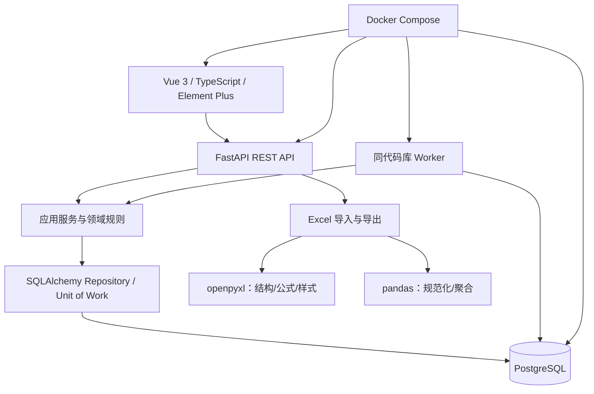
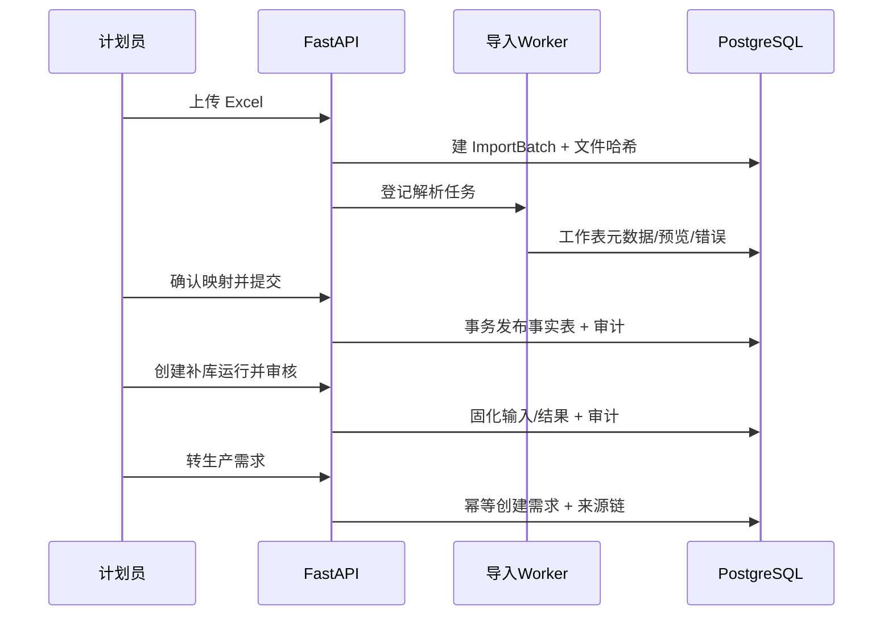

# 本项目最终架构建议

## 1. 架构结论

“福兰特轻量生产计划执行系统”建议采用模块化单体，而不是微服务，也不内嵌完整 ERP 或 APS：



最终技术栈保持不变：

- 前端：Vue 3、TypeScript、Element Plus；建议 Vite、Pinia、Vue Router、Axios。
- 后端：FastAPI、SQLAlchemy 2.x；建议 Pydantic 2、Alembic。
- 数据库：PostgreSQL。
- Excel：openpyxl 负责结构/公式/合并单元格，pandas 负责规范化和批量统计。
- 部署：Docker Compose。

四个参考项目只影响领域边界与交互原则，不成为代码、框架或运行依赖。

## 2. 系统边界

### 2.1 本项目负责

- 产品、产品族、别名、工序、工艺版本、设备、模具、标准产能和工作日历。
- Excel 数据导入、原始批次、字段映射、校验错误和可追溯发布。
- 历史销量、库存/在制快照、补库计算、建议审核和生产需求。
- 周排产、工单、工序任务、需求分配、计划版本、插单和顺延。
- 车间开始/暂停、报工、冲销、更正、异常上报和数量投影。
- 漏排、少排、超能力、资源冲突、前序不足、逾期和数据质量异常。
- RBAC、工序/车间数据范围、审计和导出。

### 2.2 本项目不负责

- ERP 采购、销售、财务、成本会计、仓库过账和完整 BOM 领退料。
- 自动生成全局最优计划的 APS 求解器。
- PLC/OPC UA/MQTT 设备采集、OEE、SPC 和复杂质量检验（后续独立评估）。
- 多工厂、多租户、通用低代码表单和工作流引擎。
- frePPLe、ERPNext 或 OpenMES 的嵌入部署。

## 3. 模块划分

后端按业务能力划分模块，每个模块包含 API、schema、application service、domain rule 和 repository；不要按“所有 controllers/所有 services/所有 models”形成跨业务巨型目录。

| 模块 | 职责 |
|---|---|
| `identity` | 登录、令牌、用户、角色、权限和数据范围 |
| `master_data` | 产品、别名、产品族、工序、设备、模具、工作中心、能力日历 |
| `routing` | 工艺模板、版本、步骤、产品绑定和发布 |
| `imports` | 文件、工作表识别、字段映射、预览、校验、提交和撤销 |
| `replenishment` | 历史销量、库存/在制快照、补库策略、运行、建议和审核 |
| `demand` | 生产需求、来源链、状态和需求分配 |
| `planning` | 周计划、版本、甘特排程、冲突校验、发布、插单和顺延 |
| `execution` | 生产工单、工序任务、开始/暂停、报工、冲销和数量投影 |
| `issues` | 规则扫描、异常去重、确认、解决和关闭 |
| `audit` | 通用追加写审计和查询 |
| `reporting` | 首页看板、周报、Excel 导出和只读聚合 |

模块间只通过应用服务或明确的领域接口协作，不让前端串联多个写 API 来完成一个事务。

## 4. 推荐代码结构

```text
flante-lite-mes/
├─ backend/
│  ├─ app/
│  │  ├─ main.py
│  │  ├─ core/                 # 配置、数据库、认证、错误、日志
│  │  ├─ modules/
│  │  │  ├─ master_data/
│  │  │  ├─ routing/
│  │  │  ├─ imports/
│  │  │  ├─ replenishment/
│  │  │  ├─ demand/
│  │  │  ├─ planning/
│  │  │  ├─ execution/
│  │  │  ├─ issues/
│  │  │  └─ identity/
│  │  ├─ worker/               # 复用应用服务的后台任务入口
│  │  └─ shared/               # Decimal、时间、分页、幂等、审计等
│  ├─ alembic/
│  └─ tests/
├─ frontend/
│  ├─ src/
│  │  ├─ api/
│  │  ├─ modules/              # 与后端业务模块对应
│  │  ├─ components/
│  │  ├─ stores/
│  │  ├─ router/
│  │  └─ utils/
│  └─ tests/
├─ deploy/
│  ├─ docker-compose.yml
│  └─ nginx.conf
└─ docs/
```

这是 yuwang/MES 清晰分层思想在 Python/Vue 技术栈中的重新实现，不采用其 .NET 项目结构和源码。

## 5. 业务主链和事务边界

### 5.1 导入到需求



文件解析不在 HTTP 请求中长时间阻塞。无需立刻引入 Redis/Celery；首版可以在 PostgreSQL 建任务表，由独立 `worker` 容器用 `FOR UPDATE SKIP LOCKED` 领取任务。API 与 worker 使用同一代码和领域服务。

### 5.2 排产事务

创建/拆分工单时，在一个事务中：

1. 锁定需求记录；
2. 重算有效分配和剩余待排；
3. 校验同产品、工艺、批量和数量；
4. 创建/更新工单、分配与工序任务；
5. 检查设备、模具、能力和前序；
6. 写计划变更事件和审计；
7. 提交后返回新的版本号和全部影响。

前端拖拽只是发起一个业务命令，不能分别更新任务日期、需求数量和设备占用。

### 5.3 报工事务

1. 验证操作者权限、工单/任务状态、前序和阻塞异常；
2. 用 `idempotency_key` 防止重复提交；
3. 追加报工或冲销事件；
4. 汇总工序任务有效数量；
5. 若为最终必需工序，更新工单和需求合格完成投影；
6. 派生任务/工单/需求状态；
7. 生成超量、逾期或数量不一致异常；
8. 同事务写审计。

## 6. 状态设计

### 6.1 计划

`DRAFT → PUBLISHED → IN_EXECUTION → COMPLETED`，可从 DRAFT/PUBLISHED 取消。已发布计划修改产生新版本，不回到同一条 DRAFT 记录上覆盖历史。

### 6.2 生产需求

状态由数量和动作派生：

- 待审核；
- 待排（有效分配为 0）；
- 部分排产；
- 已排产；
- 生产中；
- 已完成；
- 已取消；
- 已关闭。

取消与关闭必须是显式动作并记录原因，不能只由数量公式触发。

### 6.3 工单与工序任务

工单拆分生命周期、进度和阻塞三个维度。工序任务使用 PENDING、READY、IN_PROGRESS、PAUSED、COMPLETED、SKIPPED、CANCELLED；READY、COMPLETED 等由规则派生。

OpenMES 的阻塞异常和 ERPNext 的派生状态值得借鉴，但不复制枚举或实现。

## 7. 计划引擎的分阶段能力

### 7.1 首版：可解释的规则校验

- 需求不得超分配。
- 设备/模具时间段不得无授权重叠。
- 资源日负荷不得超过可用分钟；显示标准能力依据和缺口。
- 前序任务合格量/预计完成必须满足后序投入。
- 工艺必需步骤不能缺失。
- 产品批量、倍数和冻结窗口必须满足。
- 交期风险显示预计延迟天数。

### 7.2 后续：建议式排产

在数据质量稳定后，可增加规则排序和空档推荐：按优先级、交期、连续未排天数、换模成本和资源可用性提出候选，不自动发布。

### 7.3 暂不实现：APS 优化

不在首版实现 frePPLe 式约束求解、替代网络、全局优化和场景复制。如果未来确需 APS，先稳定本项目的需求、能力、工艺、执行反馈和 API，再将 APS 作为可替换的外部规划适配器评估。

## 8. Excel 架构

### 8.1 解析流水线

1. 保存文件元数据、SHA-256、来源日期和导入类型；文件本体放受控卷或对象存储（首版可用 Docker volume）。
2. openpyxl 只读扫描真实范围、合并单元格、公式、缓存值、样式与候选表头。
3. 将选定区域转成规范化行；pandas 用于批量类型转换、连接、分组与统计。
4. 原始值、规范值、产品匹配证据和错误分别保存。
5. 预览与全量校验不写正式业务表；用户提交后才在事务中发布。
6. 导出以当前权威数据重新生成，不以原文件公式缓存为事实。

### 8.2 性能和可靠性

- 以工作表真实非空范围为边界，避免百万格式空行。
- 大文件流式/只读处理；数据库批量写入分块，但正式发布保持批次原子性。
- 文件哈希 + 导入类型 + 来源日期 + 幂等键防重复。
- 每个错误带工作表、Excel 行号、字段、原值、错误码和修正建议，可导出。

## 9. API 规范

- 统一 `/api/v1`；OpenAPI 自动生成，前端类型可由 schema 生成或严格手工同步。
- 资源查询使用 GET；业务动作使用明确命令端点，如 `/plans/{id}/publish`、`/reports/{id}/reverse`。
- 列表统一分页、字段筛选和白名单排序；20,000 SKU 产品搜索必须服务端执行。
- 错误统一为 `code`、`message`、`details`、`request_id`；冲突使用 409 并返回可操作证据。
- 写请求支持 `Idempotency-Key`；可并发编辑对象返回 `version_no`，旧版本更新返回 409。
- 日期用 ISO 8601；业务日为 `date`，时间戳为带时区 UTC，前端按工厂时区展示。
- 数量 API 使用十进制字符串或经验证的 Decimal 序列化策略，不允许浮点误差进入数据库。

## 10. 权限、安全和审计

### 10.1 授权

预置 ADMIN、PLANNER、FOREMAN、VIEWER 只是角色模板。后端实际校验权限码与数据范围：

- 计划员：需求、补库、草稿计划；发布/冲突覆盖可单独授权。
- 班组长：只读授权工序/工作中心的任务，可开始、报工和报异常。
- 查看者：看板和授权范围只读。
- 管理员：用户、角色、主数据和审计；高风险业务动作仍要求原因。

JWT 只承载稳定身份与短期声明，权限以服务端数据库为准。密码使用成熟哈希库；密钥通过环境变量/secret 管理，不进入仓库。

### 10.2 审计

- 通用审计保存请求、人、对象、动作、前后值、原因、IP 和时间。
- 计划用业务版本，报工用冲销链，需求用分配/释放链，工艺用发布版本。
- 应用数据库用户无权修改/删除审计行；管理员页面只读。
- 日志中屏蔽密码、令牌、数据库连接串和导入文件敏感内容。

## 11. 异常扫描架构

异常规则分两类：

- 写入时规则：超分配、资源重叠、明显超能力、前序不足、工艺缺失、报工超量。
- 定时规则：确认后未排、少排、跨周未排、到时未开工、无报工、逾期、未完成未结转、负在制、主数据缺失。

定时规则由 worker 执行；`dedupe_key = rule_code + entity_type + entity_id + scope`，重复命中更新证据和最近发现时间。规则实现为可单元测试的纯函数/查询服务，不允许在 Vue 中各自计算。

## 12. PostgreSQL 与查询策略

- 所有业务表有 `created_at`、`updated_at`，关键表有 `version_no`；数量 `NUMERIC(18,6)`。
- 为产品编码/名称/规格建立适合中文和模糊搜索的索引策略；是否启用 `pg_trgm` 先以真实查询验证。
- 需求池索引覆盖状态、产品、交期、创建日期和剩余待排；任务覆盖工序、设备、计划起止和状态。
- 看板先用查询视图和合理索引；数据量证明需要后再用物化视图，不提前引入外部分析库。
- 汇总字段必须有重算命令和一致性检查，避免 yuwang/MES 式增量差错长期累积。
- 迁移只用 Alembic；生产数据库变更备份、演练、可回滚，禁止应用启动时隐式建表。

## 13. 前端架构

- 页面按业务模块切分，API client、类型、store 和组件尽量共置。
- Pinia 只保存登录身份、稳定筛选和少量跨页状态；服务端数据不建立庞大全局镜像。
- 甘特/时间轴作为本项目自有组件：虚拟化资源行、可视时间窗、拖拽预览、键盘可访问、服务端冲突结果。
- Element Plus 用于表单、表格、抽屉、对话框和反馈；不要为追求视觉一致复制参考项目 CSS。
- 班组端提供触控尺寸、数字键盘、大按钮和网络重试；首版不承诺离线报工。

## 14. Docker Compose 部署

建议服务：

| 服务 | 作用 |
|---|---|
| `web` | 构建后的 Vue 静态文件与反向代理 |
| `api` | FastAPI，多 worker 数按服务器核数和数据库连接池调优 |
| `worker` | Excel 解析、异常定时扫描、导出等后台任务 |
| `postgres` | PostgreSQL，独立持久卷、健康检查和备份策略 |

首版不强制 Redis、消息队列、Kubernetes 或对象存储。上传目录、导出目录和数据库卷需明确备份与保留期。Compose 配置分开发/生产环境，生产不挂载源代码，不使用默认密码，不暴露 PostgreSQL 公网端口。

## 15. 测试与验收

### 15.1 后端

- 补库纯函数：六个月最大/平均/加权、负在制、批量取整、空数据。
- 需求分配：拆分、合并、释放、并发超分配。
- 状态机：取消、关闭、部分排产、最终工序完成、冲销后的回退。
- 计划规则：设备/模具冲突、日能力、前序不足、冻结窗口和授权覆盖。
- 报工：幂等、冲销、更正、最终工序完成量和投影重算。
- Excel：多行表头、合并单元格、公式、前导零、格式空行和重复文件。
- 权限：每个高风险端点至少验证允许、拒绝和数据范围三类用例。

### 15.2 前端

- 需求池筛选和数量证据抽屉。
- 甘特拖拽、冲突、版本过期、部分排产和草稿恢复。
- 车间开始/报工/异常/冲销的关键路径。
- 20,000 SKU 搜索不全量加载；长列表性能。

### 15.3 端到端验收

使用两份现有 Excel 样表完成：导入 → 校验 → 补库计算 → 审核 → 需求 → 周排产 → 发布 → 报工 → 异常与审计，并能导出与原周计划结构可对照的 Excel。

## 16. 实施顺序

继续沿用阶段 0 的渐进路线，并在开工前补一个模型定名决策：

1. 工程、数据库迁移、认证授权、审计和 Excel 扫描骨架。
2. 产品/别名/导入中心和样表全量校验。
3. 补库计算、证据、审核和生产需求。
4. 工艺版本、资源、能力、生产工单和工序任务。
5. 周排产、冲突规则、需求分配和计划版本。
6. 车间执行、追加写报工、冲销和异常闭环。
7. 看板、性能、备份、安全和生产化部署。

在第 4 阶段编码前，确认并统一现有文档中的 `production_task` 命名：采用本建议的 `work_order + operation_task`，或明确 `production_task` 只代表其中一层，避免两套术语长期并存。

## 17. 架构决策摘要

| 决策 | 选择 | 理由 |
|---|---|---|
| 系统形态 | 模块化单体 | 团队和业务规模下最易交付、事务清晰 |
| 计划方式 | 人工周排产 + 服务端规则校验 | 可解释、贴合现行 Excel，不提前承担 APS 风险 |
| 制造对象 | 需求—工单—工序任务—报工 | 既防漏排，又支持多工序执行 |
| 工艺历史 | 模板版本 + 执行快照 | 主档变化不污染历史 |
| 报工修正 | 追加写 + 冲销/更正 | 保证追溯和数量可重算 |
| 后台任务 | PostgreSQL 任务表 + 同库 worker | 不增加首版基础设施复杂度 |
| 计划历史 | 不可变计划版本 | 插单和顺延可追溯 |
| 权限 | RBAC + 动作 + 工序/车间范围 | 比固定角色名更准确，仍保持轻量 |
| 开源参考 | 概念研究，代码零复制 | 满足许可证和项目要求 |

以上建议完成后应停止在分析阶段；下一步开发须由项目负责人明确启动，不在本次研究任务内自动开始。
